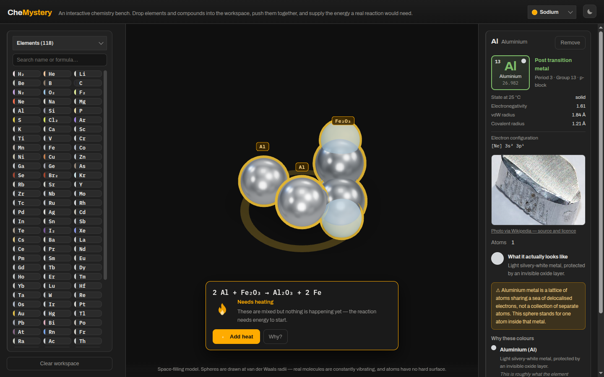

# CheMystery

**CheMystery is an interactive 3D chemistry bench for anyone learning how reactions
actually work.** Drag elements and compounds into the workspace, push them together, and
supply the energy a real reaction would need.

[**🔬 Live demo**](https://d33ptar00p.github.io/chemystery/)



## What it does

- **246 species** — all 118 elements, plus around 78 inorganic and 46 organic compounds.
- **68 balanced reactions** across combustion, synthesis, decomposition, acid–base,
  precipitation, displacement and redox.
- **Nothing reacts on contact.** Most of these mixtures really are stable until something
  ignites them, so the app asks you for a spark, heat, a current, UV light or a catalyst.
- **Space-filling models** built from VSEPR geometry, coloured by what substances actually
  look like — with the app stating plainly where each colour comes from when a substance
  is colourless.

## How to run locally

Node.js v20+ and npm v10+.

```bash
git clone https://github.com/D33ptar00p/chemystery.git
cd chemystery
npm install
npm run dev
```

Then open the printed URL. `npm test` runs the engine and chemistry-data checks;
`npm run build` produces a static site in `dist/`.

## A note on the chemistry data

Every equation is machine-checked for atom balance against the species table on each test
run, and every molecule is checked for sane geometry. That catches structural errors, not
wrong numbers — a plausible but incorrect bond length or van der Waals radius will pass.
The organic table was compiled against literature sources; the element, inorganic and
reaction tables were assembled from standard reference values without source-by-source
verification. Treat it as a teaching toy, not a reference.

## Contact

Bug reports and suggestions are welcome via
[GitHub issues](https://github.com/D33ptar00p/chemystery/issues).
